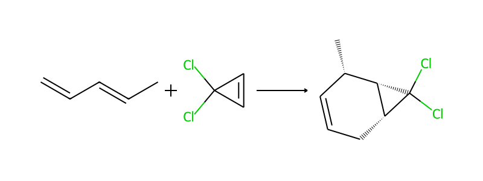

# geomtosmarts.py

**TL;DR - I made a Python package to convert transition state Gaussian .out files to reaction SMILES.**

---

In my spare time recently I have been looking into different chemical representation for ML. Previously I have used *atom-based* features, meaning that the features used in the ML model are taken from atoms that are known for the chemical system. These atom based features are typically really informative on the chemical system and can describe the environment around the reaction centre well. This is also a potential drawback in that the atom numbers for every single reaction within a dataset needs to be known and consistent (at at least attainable). Another issue is that this feature representation only works when the same number of features are taken for each reaction. An example where this falls down is when a model built on cycloaddition data tried to predict on Michael addition data. This would not be possible with this approach.

There are several methods that look at providing a more general feature representation of a chemical reaction. Namely, a [recent paper](https://doi.org/10.1021/acs.jcim.4c00157) looked at using self-supervised learning to generate a reaction indifferent representation. This approach is called **ReaKE**. To create this representation, a reaction SMILES is required...

## Reaction SMILES

[SMILES strings](https://www.daylight.com/dayhtml/doc/theory/theory.smiles.html) are one of the most common ways to represent chemical reactions as a string. The reaction part simply just indicates the chemical reaction... fairly straight forward! The combination of these is also straight forward. 

[Reaction SMILES](https://www.daylight.com/meetings/summerschool01/course/basics/smirks.html) are again defined really well from the creators. In its simplest form, the user needs to know the reactants and products. Below is an example of a reaction SMILES:

```
[H]C([H])=C([H])/C([H])=C(\[H])C([H])([H])[H].[H]C1=C([H])C1(Cl)Cl>>[H]C1=C([H])[C@]([H])(C([H])([H])[H])[C@]2([H])C(Cl)(Cl)[C@]2([H])C1([H])[H]
```

Breaking this down, reactants are on the left and separated by ```.```. To designate the difference between reactants and products, the user adds ```>>```. There is more functionality but for the purpose of this post, that will do.

These reaction SMILES then get fed into the [ReaKE website](https://bio-web1.nscc-gz.cn/app/ReaKE_fingerprints) or the [ReaKE code](https://github.com/biomed-AI/ReaKE) to generate the representation.

## geomtosmarts

Now that we know what is required to create the representation, how do we go from a transition state structure to a reaction SMILES? As far as I am aware, there was no code to outright do this so I decided to try code it myself. Full information can be found on the [GitHub](https://github.com/samgeoesp/geomtosmarts).

Essentially, the code works by splitting up the transition state calculation into its reactants and product. It does this using the displacement vector from a frequency calculation to create two adjacency matrices. One is close to product and the other shares more resemblance of two reactants. From this, the code determines the reactants and products which are then used to create the reaction SMILES. 



## Use Cases

In the original ReaKE paper they have a few different downstream tasks which highlights the flexibility of this representation. I will update this post when I have an example ready so watch this space!