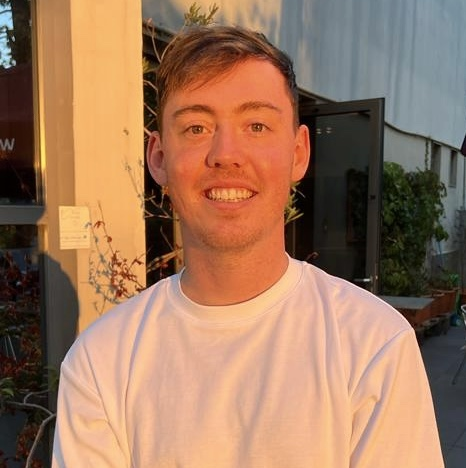

# Blog - Sam Espley

## About me

I think a lot of people with agree with me that writing about yourself is a labourious task that never truly feels comfortable. Considering that, I will endevaour to keep it short and sweet! I am, *currently*, a final year PhD student at the University of Bath studying computational chemistry. My undergraduate was at the University of Southampton in standard chemistry and I enjoyed it a lot. Originally from Brighton but ended up in Bath via a year in Sweden. As much as I hate it, I may do a post about me in a bit more detail at some point but this is plenty for now! 

# [Gradient Descent](gradient_descent.md)

