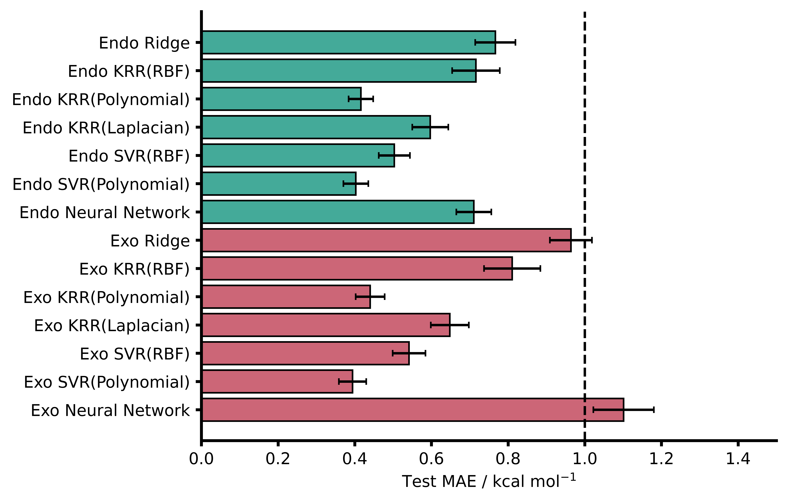
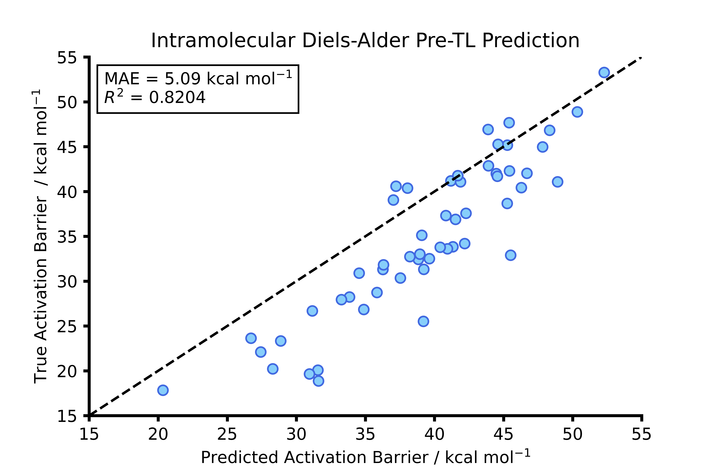
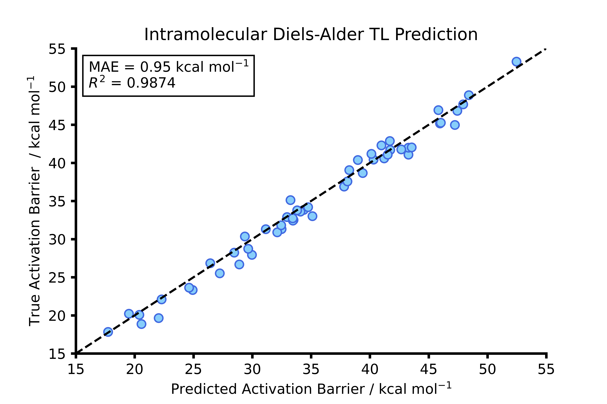
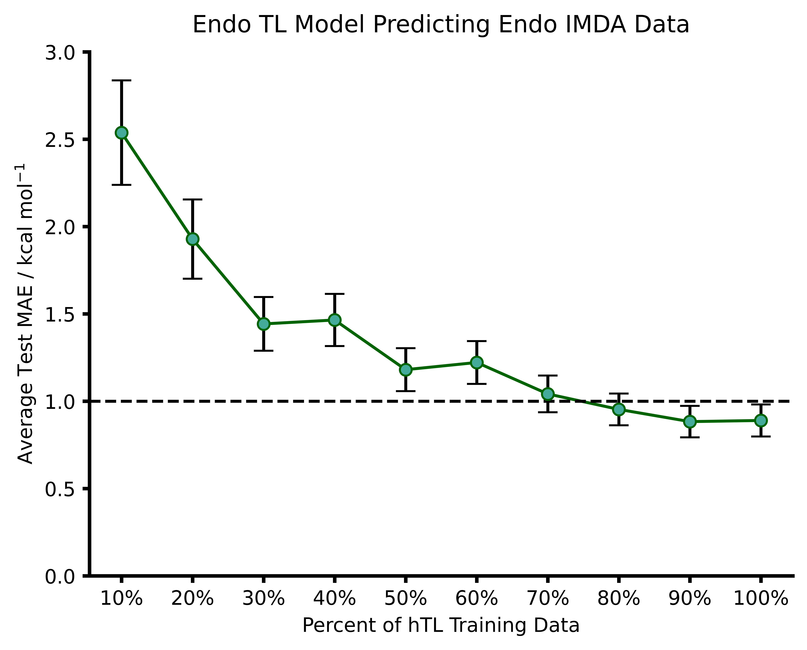

# Transfer Learning for Reaction Barrier Predictions.

I felt that the best way to kick this off was a *relatively* informal post about some research that I have published during my PhD meaning that this post is about my paper title
**[Machine learning reaction barriers in low data regimes: a horizontal and diagonal transfer learning approach](https://doi.org/10.1039/D3DD00085K)**. 

***All figures within this blog post are taken from the publication.***

---

This  work  was  a  large  proportion  of  my PhD research and built upon **[previous work](https://doi.org/10.1039/D2SC02925A)** in our research group. In this work we had used standard  machine learning models to predict DFT accurate reaction barriers for nitro-Michael addition reactions from low level semi-empirical methods (SQM). To build on this we wanted  to explore the possibility of using transfer learning to leverage some accuracy in low data. The data requirements needed to be as low as possible so that the associated computational cost of running DFT. The paper is available above so I wont go into too much detail here but rather summarise some of important aspects.
---

## Pre-ML Metrics

To begin with we needed a benchmark for how the SQM method chosen (AM1) was at calculating the barriers relative to the DFT derived barrier. The figure below plots the AM1 barrier vs. the DFT barrier to show that the AM1 calculations over-estimate the DFT barrier consistently.

The goal of this project was to lower the pre-ML AM1-DFT MAE from 9.73 to below 1 kcal/mol. The first step for this was to perform the standard ML approach that I spoke about earlier - features extracted from AM1 calculations used to predict DFT reaction barriers.

## Standard ML Approach

Using ML models such as KRR, SVR, and a NN built in TensorFlow we were able to predict reaction barriers for the Diels-Alder reaction with a decent accuracy. We built models to predict on the endo an exo structures respectively. Across both, SVR or KRR with the polynomial kernel was best. Accuracy on the NN's were not as strong but their benefits are evident in the TL portion of the work. In hindsight, I would likely return to this and see how I could have implemented the NN's slightly differently. 

Noticably, all models for the endo dataset predicted well below (SVR best at < 0.4 kcal/mol) which is amazing and reinforces the applicability of SQM derived inputs for ML.

## Transfer Learning Approach

To avoid this becoming a long post I am going to cover the terminology quickly. To better understand the problem we were trying to solve with transfer learning (TL) we defined three terms:

| | Horizontal | Vertical | Diagonal |
| --- | --- | --- | ---|
|**TL Target Change**| Change in chemical space | Change in level of theory. | Change in both chemical space and level of theory. |
|||||

### Example - Horizontal Transfer Learning
For horizontal TL (hTL) we had a NN trained on ***intermolecular*** Diels-Alder reactions and we had a held out ***intramolecular*** Diels-Alder dataset. This intramolecular dataset was much too small to complete direct training (overfit to the train and would not be generalisable) so instead we froze some layers and retrained other of our pre-existing NN to acheive better performance.

| Pre-hTL | Post-hTL |
| :---: | :---: | 
| | | 

Prior to performing hTL we had an MAE of **5.09 kcal/mol**. This is using our NN trained on intermolecular reactions to predict intramolecular. This is obviously not at the desired accuracy, however after performing hTL. We get a MAE of **0.95 kcal/mol** which is below the 1 kcal/mol threshold we typically aim for an a great improvement. This highlights that existing models should be used frequently to leverage accuracy in different chemical spaces.

What we also wanted to investigate is how little data could we use to get improved accuracy with TL. With the same problem we looked into different hTL training data percentages. We found that with with around 70% of new training data (122 datapoints) we could achieve accuracy within error of 1 kcal/mol. What was also interesting was that with 20% of new training data we achieved an MAE of below 2 kcal/mol. This was only 35 new reactions which is significantly more feasible for computational and lab chemists!

## Reflecting

I think it is always good to look retrospectively at your own work and while I am incredibly proud of this work, there is some areas in which improvements could be made. For example, I used standard train-test splits and leave-one-out procedures and while this approach is far from incorrect, using a scaffold split might have been an interesting approach. 
All in all, this is my first-first author paper and I am incredibly grateful to have this work published. 

Thanks for reading - if you are interested about the work in more detail then check out the [paper](https://doi.org/10.1039/D3DD00085K)!