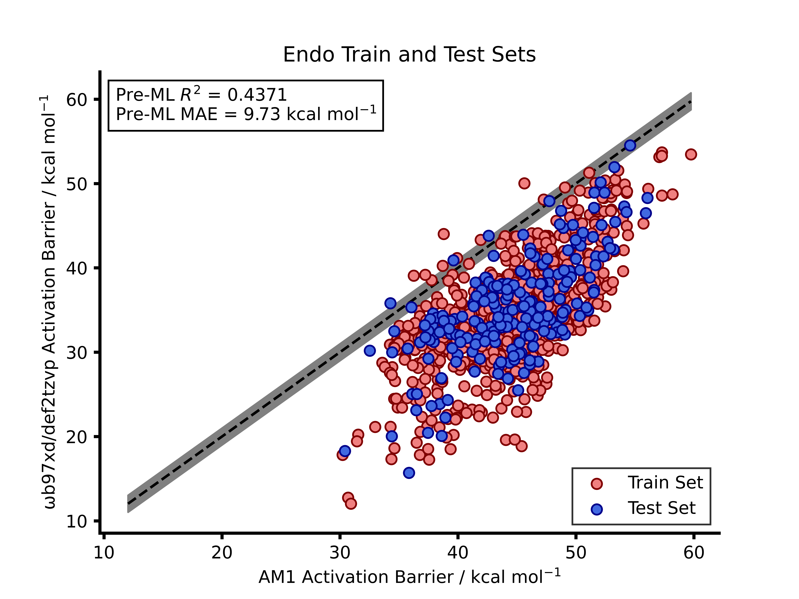

# Transfer Learning for Reaction Barrier Predictions.

I felt that the best way to kick this off was a *relatively* informal post about some research that I have published during my PhD meaning that this post is about my paper title
**[Machine learning reaction barriers in low data regimes: a horizontal and diagonal transfer learning approach](https://doi.org/10.1039/D3DD00085K)**. 

This  work  was  a  large  proportion  of  my PhD research and built upon **[previous work](https://doi.org/10.1039/D2SC02925A)** in our research group. In this work we had used standard  machine learning models to predict DFT accurate reaction barriers for nitro-Michael addition reactions from low level semi-empirical methods (SQM). To build on this we wanted  to explore the possibility of using transfer learning to leverage some accuracy in low data. The data requirements needed to be as low as possible so that the associated computational cost of running DFT. The paper is available above so I wont go into too much detail here but rather summarise some of important aspects.
So t
---

## Pre-ML Metrics

To begin with we needed a benchmark for how the SQM method chosen (AM1) was at calculating the barriers relative to the DFT derived barrier. The figure below plots the AM1 barrier vs. the DFT barrier to show that the AM1 calculations over-estimate the DFT barrier consistently.

